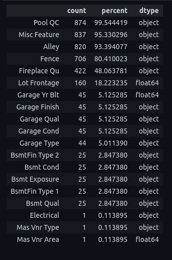
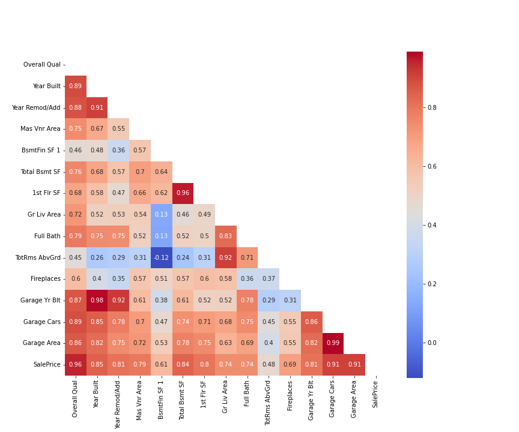

# Project 2 - Predicting Housing Prices with Linear Regression

# Introduction and Problem Statement

We are a team of data scientists working in real estate consultancy based in Iowa specialising in providing advice to clients on property investment opportunities in Ames, Iowa, using linear regression.

The aim of this project is to:

* Identify the relationship between the price of a property and the other features of the property.
* Identify undervaled houses for our cilents to invest in and flip them.

The dataset given contains data obtained from the Ames Assessories Office, and is similar to what a typical home buyer would want to know before making a purchase.

The data set contains information from the Ames Assessories office used in computing assessed values for individual residential properties sold in Ames, IA from 2006 to 2010.

The data has 82 columns, which includes 23 nominal, 23 ordinal, 14 discrete, and 20 continuous variables.

As this data is taken from Kaggle, as a compeition for this project, there are 2 data sets to be used:

* train.csv
* test.csv

The train.csv would be used to train the model, and the test.csv would be used to predict the price of the houses, which would then be uploaded into Kaggle to obtain a score, which will show how will the model do against unseen data.

# Points to take note

* The train dataset will be named as df_train, and the test dataset will be named as df_test for ease of use, and preventing of any confusion.
* Some of the data is missing.
* Removal of outliers was only done for the df_train as the df_test is not used for modeling, and kaggle does not allow for the removing of outliers.

Steps were taken to help solve the linear regression problem can be split into 4 main steps:

1. Exploratory Data Analysis
2. Data Cleaning
3. Feature Engineering
4. Modeling

# Exploratory Data Analysis

The first step in the process of building a model is to understand the data.
Basic statistics are used to find the mean, median, and standard deviation of the data. However, as the statistics can be determined for numerical vales, a separate method was used to obtain the information about categorical variables, which gave the count, unique, and frequency of each category.

**Additional Information from the data:**

* df_train consists of 2051 rows and 81 columns, while df_test consists of 878 rows and 80 columns.
* Both datas are divided into 4 main parts:
  * Nominal: These are the variables that are categorical, and are not ordered.
  * Ordinal: These are the variables that are categorical, and are ordered.
  * Discrete: These are the variables that are numerical, and are not ordered.
  * Continuous: These are the variables that are numerical, and are ordered.
* The Id column was set to the Index of the dataframe for both train and test data.
* In addition, the "PID" column was also dropped, as it indicates the Parcel Identification Number used to identify the property. It is not useful for the model.

Furthermore, due to the nature of this project being based in Iowa, Ames, USA, and me being a Singaporean, extra research has to be done to understand the housing situation in Iowa.

From a Google search, I have found these 2 sources:

1. It's All About Location, Location, Location [https://westproperties.rs/en/vesti/it-aposs-all-about-location-location-location/31]
2. 8 Critical Factors that influence a home's value [https://www.opendoor.com/w/blog/factors-that-influence-home-value]

From the above sources, I have found that the following are the most important factors that influence the value of a house:

1. Location
2. House Size
3. Age and Condition
4. Upgrades and updates

Hence, for the EDA porition of the project, the following features were investigated against the Sale Price of the house:

1. Location
   1. Neighborhood
   2. MS Zoning
2. House Size
   1. Gr Liv Area
   2. Garage Area,
   3. Total Bsmt SF
   4. 1st Flr SF
3. Age and Condition
   1. Yr Sold
   2. Year Built
   3. Year Remod/Add
   4. Garage Yr Built
   5. Overall Qua
   6. Exter Qual
   7. Kitchen Qual
   8. Bsmt Qual

The charts give a better understanding of the data, and also confirms some suspicious I had on my mind, for example, a higher sale price for a larger Gr Liv Area.
In addition, outliers in the Gr Liv Area can be seen, which would be removed later.

# Data Cleaning

As mentioned earlier, the Gr Liv Area has some outliers seen in the data. Furthermore, from the distribution data above, the right skewed distribution of the feature can be seen. Hence, a IQR*1.5 method will be used to remove the outliers.

The removal of outliers resulted in a 64 outliers detected, which was then removed, resulting in the following distributions:

This gave the Gr Liv Area a more normal distribution, which would help in the modeling process. The range of the Gr Liv Area resulted in is from 229.75 to 2627.75. Anything below or above these numbers, the model will not be able to predict very well.

With the null values heatmap visualized below, we found out that there are some features with more than 50% of null values.

Using this, a further investigation of the null values were conducted, and it was found that the null values were justified, as it states that the house does not have that particular feature.

For the features with null values, those except the Lot Frontage and the Mas Vnr Area, will be imputed with "NA", as those houses do not have those features.
For the null values in Mas Vnr Area, they will replaced with 0. The null values in Lot Frontage will be imputed with the mean value of Lot Frontage (this will be done with train test split).

# Feature Engineering
A heatmap between the features with more than 0.4 correlation to SalePrice was created to further look at the correlation between the features and SalePrice.

Looking at the correlation heatmap, some features that have a high correlation to each other was found and the following transformations made:

| Feature                                                 | Transformation                                                         |
| ------------------------------------------------------- | ---------------------------------------------------------------------- |
| Garage Cars and Garage Area                             | Garage Cars dropped                                                    |
| Gr Liv Area, 1st Flr SF, 2nd Flr SF, Low Qual Fin SF    | 1st Flr SF, 2nd Flr SF and Low Qual Fin SF will be dropped             |
| Year Built, Year Remod/Add, Year Built                  | All columns will be dropped, and a new column age_sold will be created |
| Total Bsmt SF, BsmtFin SF 1, BsmtFin SF 2, Bsmt Unf SF  | BsmtFin SF 1, BsmtFin SF 2, Bsmt Unf SF will be dropped                |
| Bsmt Full Bath, Bsmt Half Bath, Full Bath, Half Bath    | A new column total_bathrooms will be created                           |
| Open Porch SF, Enclosed Porch, 3Ssn Porch, Screen Porch | A new column total_porch_area will be created                          |

In addition, other ordinal features will be converted to number ranking, 1,2,3,4...

# Modeling
* A train test split was used to split the data into training and testing data. The missing numerical data was imputed with the mean value of the training column.
* Categorical - OneHotEncoded
* Non-Categorical - MinMaxScaled

Linear regression was used to train the model, and mean squared error was used as an evaluation metric.
| mse_train         | mse_test              | Difference              |
| ----------------- | --------------------- | ----------------------- |
| 388414961.0115108 | 3.871303272892888e+31 | -9.966926255392518e+24% |

As this clearly indicates that the model is overfitting to the training data, a regularization technique will be used to reduce the overfitting.

GridSearch will be used to find the best parameters for the model, and to find out which regularization gives the best results.

| Best Parameters  | train_mse          | test+mse           | Difference |
| ---------------- | ------------------ | ------------------ | ---------- |
| Lasso(alpha=100) | 468771061.78458714 | 450205263.39580494 | 3.96%      |

Upon receivng the best model, a coefficient plot was created to visualize the coefficients of the model.

The coefficients were then reverse calucalted with minmaxscaler, and the reverse calcualted coefficients were used to show the importance of the features.

# Conlcusion
 The model was able to predict the Sale Price of the house with a mean squared error of 3.96%, and within the ranges of 50000 and 250000.
In addition, it can only do well if the Gr Liv Area is within the range of 229.75 and 2627.75.

Returning to the problem statement, for investor who want to increase the sale price of the house, the most important thing they can do is to increase some of the following: 
* Increase Gr Liv Area - $52.61
* Increase Overall Qual - $8126.04
* Increase Exter Qual - $8553.64
* Make sure that the house is fully functional - $4027.89
* Increase Over Condition - $3745.21
* Total Bsmt SF - $20.79
* Mas Vnr Area - $30.77
* Lot Area - $0.27

This also ties in with the research found in EDA, that the house size matters in the sale price of the house.
Surprisingly, there are other unexpected features that would increase sale price, like fireplace and total bathrooms, whereas, bedroom abvgrd is at the other end, this may mean that decreasing the number of bedrooms for an increase in the gross living area, increases the sale price.

Furthermore, it is surprising that location does not appear in the p-values list as an important feature in the lass coefficients with p-values taken into consideration.

Another obvious known fact is that as the house age increases, the sale prices decreases by -$191.99

# Recommendations
It is recommended to obtain more year data, especially in 2010, as there seems to be an incomplete data set for that year.
Additionally, other housing data from other surrounding states/city will be also be helpful, as people may not necessary want to stay in the same city.